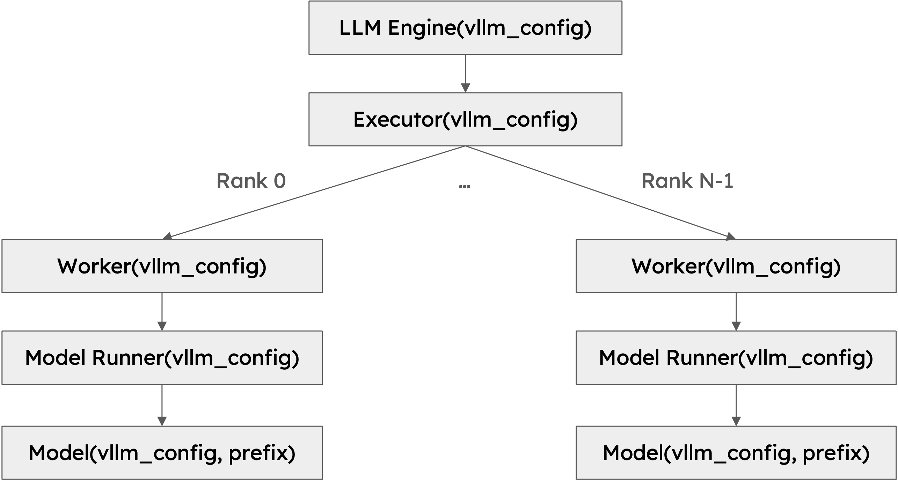

# vLLM 源代码阅读（一）

本文主要基于 vLLM 官方开源的文档进行总结梳理，主要是为了对 vLLM 推理架构有基本的了解。

## EntryPoint

为了实现和推理系统的交互，vLLM 提供了一系列的入口，主要为 LLM class 和 OpenAI-compatible API Server。其分别是用于离线推理 Offline Inference 或者在线服务 Online Service。

**LLM class** 是离线推理服务的主要 Python 接口，无需单独的模型推理服务器，而直接和模型进行交互。

```python
from vllm import LLM, SamplingParams

# Define a list of input prompts
prompts = [
    "Hello, my name is",
    "The capital of France is",
    "The largest ocean is",
]

# Define sampling parameters
sampling_params = SamplingParams(temperature=0.8, top_p=0.95)

# Initialize the LLM engine with the OPT-125M model
llm = LLM(model="facebook/opt-125m")

# Generate outputs for the input prompts
outputs = llm.generate(prompts, sampling_params)

# Print the generated outputs
for output in outputs:
    prompt = output.prompt
    generated_text = output.outputs[0].text
    print(f"Prompt: {prompt!r}, Generated text: {generated_text!r}")
```

上述代码通过一个简单的样例，初始化 LLM class 以及其相关的参数，并使用 generate 函数进行模型推理输出。

**OpenAI-Compatible API Server** 主要是提供在线的推理服务，主要可以通过两种方式进行使用，分别为 Bash 命令行或者 Python 命令行启动。

```bash
# Utilize the shell command
vllm serve <model>
# Running the python CLI
python -m vllm.entrypoints.openai.api_server --model <model>
```


## LLM Engine

**LLM Engine** 和 **AsyncLLMEngine** 是 vLLM 推理框架中核心功能的组件，主要解决模型推理以及异步的请求处理。LLM Engine 是基础类，而 AsyncLLMEngine 主要是服务于在线推理服务，集成自 LLM Engine。

LLM Engine 负责接收客户端发送的请求，并基于底层的模型生成输出。LLM Engine 主要包括输入处理、模型执行、调度、以及输出处理。

- 输入处理：基于特定的 tokenizer 对用户的输入文本进行分词；
- 调度：在每一步选择合适的请求进行调度；
- 模型执行：管理大语言模型的推理执行，包括在多块 GPU 上的分布式执行；
- 输出处理：处理推理框架的输出，将大模型的 token ids 转化为用户可阅读文本。

AysncLLMEngine 是 LLM Engine 的异步封装，利用 asyncio 来创建后台循环来实现对请求的持续处理。

## Worker

在 vLLM 推理框架中，worker 是一个执行模型推理的进程。vLLM 遵循实践经验使用一个进程控制一个加速器。如果我们的推理参数中 tensor parallel size 和 pipeline parallel size 都设置为 2，那么总共会有 4 个 worker 工作。worker 通过 rank 和 local rank 进行识别，其中 rank 主要用于全局信息，而 local rank 主要用于分配加速器和局部资源。

## Model Runner

每一个 Worker 都会有一个 Model Runner 对象，主要用于实现对模型参数的加载以及模型推理的运行。

## Model

每个 Model Runner 对象一般都会包含一个 Model 对象，通常是 torch.nn.Module 实例。

## Hierarchy

